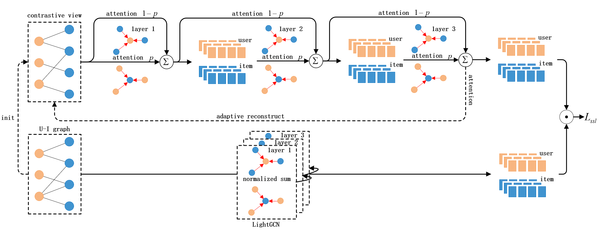

 # Adaptive Denoising Graph Contrastive Learning with Memory Graph Attention for Recommendationn

<font color='red'>The implementation code will be released after the acceptance of the paper.</font>

This is the PyTorch implementation for **ADGA** proposed in the paper **Adaptive Denoising Graph Contrastive Learning with Memory Graph Attention for Recommendation**.

> Gang-Feng Ma, Xu-Hua Yang, Liang-Yu Gao, Ling-Hang Lian. 2024. Adaptive Denoising Graph Contrastive Learning with Memory Graph Attention for Recommendation.



## 2. Running environment

We develop our codes in the following environment:

- python==3.9.18
- numpy==1.24.3
- torch==1.13.0
- torch-cuda=11.7

## 3. Datasets

| Dataset      | # User   | # Item | # Interaction | Interaction Density |
| ------------ |----------| ------ | ------------- | ------------------- |
| Last.FM      | 1,892    | 17,632 | 92,834        | 2.8 × $10^{-3}$     |
| Yelp         | 42,712   | 26,822 | 182,357       | 1.6 × $10^{-4}$     |
| BeerAdvocate | 10,456   | 13,845 | 1,381,094     | 9.5 × $10^{-3}$     |

## 4. How to run the codes


- Last.FM

```python9
 python Main.py --data lastfm
```

- Yelp

```python9
python Main.py --data yelp
```

- BeerAdvocate

```python9
 python Main.py --data beer
```
